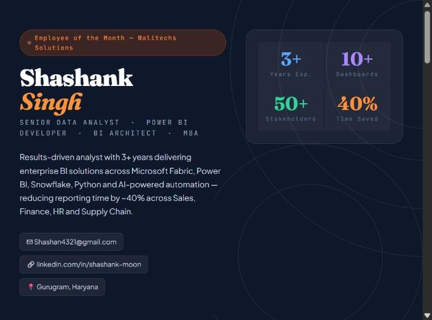

# shashan4321.github.io: Portfolio of Shashank Singh

**Live site → [shashan4321.github.io](https://shashan4321.github.io)**

Personal portfolio of **Shashank Singh**, Senior Data Analyst (Power BI · Microsoft Fabric · Snowflake · SQL · Python · GenAI), Gurugram, India. 🏆 Employee of the Month, Walitechs Solutions.



## Sections

| Section | What's there |
|---|---|
| Hero | Role, headline impact stats, contact links, open-to-work status |
| Skills ticker | Microsoft Fabric, OneLake, Power BI, DAX, Snowflake, SQL, Python, D365, Claude AI, NL-to-SQL |
| Professional experience | Walitechs Solutions (Senior Data Analyst, 2023-present), IndiaMART (Business Delivery Executive, 2022-23) |
| Key analytics projects | 8 project cards; the open-source versions are linked below |
| Skills, education, achievements | Grouped skill tags, MBA / B.Com (Hons) BHU, certifications |

## Projects on GitHub (code, tests and CI)

| Project | Repo |
|---|---|
| NL-to-SQL analytics agent (Claude tool use, SQL guardrails, eval set) | [nl-to-sql-analytics-agent](https://github.com/Shashan4321/nl-to-sql-analytics-agent) |
| Microsoft Fabric medallion lakehouse + Direct Lake | [fabric-lakehouse-end-to-end](https://github.com/Shashan4321/fabric-lakehouse-end-to-end) |
| Snowflake JSON CDC with Streams + Tasks | [snowflake-json-cdc-pipeline](https://github.com/Shashan4321/snowflake-json-cdc-pipeline) |
| ERP migration toolkit, Dynamics AX → D365 Business Central | [erp-migration-toolkit-ax-to-d365](https://github.com/Shashan4321/erp-migration-toolkit-ax-to-d365) |
| AI report automation (Claude + scheduled e-mail) | [ai-report-automation](https://github.com/Shashan4321/ai-report-automation) |
| Sales intelligence: Power BI TMDL, DAX, RLS, churn model | [sales-intelligence-powerbi](https://github.com/Shashan4321/sales-intelligence-powerbi) |
| DAX patterns library | [DAX-Measures-Library](https://github.com/Shashan4321/DAX-Measures-Library) |

## Built with

Single-file HTML + CSS (no framework, no build step), Google Fonts, hosted on GitHub Pages. Responsive layout, dark theme.

## Run locally

```bash
git clone https://github.com/Shashan4321/shashan4321.github.io.git
cd shashan4321.github.io
python -m http.server 8000   # open http://localhost:8000
```

## Contact

✉ shashan4321@gmail.com · [LinkedIn](https://www.linkedin.com/in/shashank-moon) · [GitHub](https://github.com/Shashan4321)
